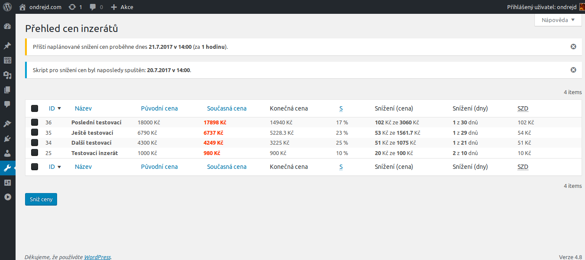

# Pravidelné snižování cen

Jednoduchý plugin pro [WordPress][1], který pravidelně snižuje cenu inzerátů vytvořeného pomocí pluginu [Advanced Classifieds &amp; Directory Pro][2].

## Upozornění

__Plugin je vytvořen na míru webu [Nepotrebujem.eu][3], takže je pravděpodobné, že jej pro vaše použití budete muset upravit. Pokud o něco takového máte zájem, můžete si to objednat i přímo od [autora][4].__

__Plugin vyžaduje plugin [Advanced Classifieds & Directory Pro][2] - bez tohoto pluginu nainstalovaného nebudete moci aktivovat tento plugin__.

## Poznámka k implementaci

Plugin předpokládá, že produkty, které plugin <abbr title="Advanced Classifieds & Directory Pro">_ACADP_</abbr> vytváří, jsou rozšířené o hodnoty `price_orig`, `price_reduce` a `price_reduce_days`.

## Popis pluginu

* plugin pravidelně snižuje cenu u inzerátů vytvořených pomocí pluginu <abbr title="Advanced Classifieds & Directory Pro">_ACADP_</abbr>, které obsahují meta hodnoty `price`, `price_orig`, `price_reduce` a `price_reduce_days`,
* plugin umožňuje nastavit, kdy bude příslušna úloha spuštěna (pro spouštění je využita funkce [`wp_cron`][5],
* plugin obsahuje přehledný výpis o provedených změnách cen,
* plugin obsahuje přehledný výpis <abbr title="Advanced Classifieds & Directory Pro">_ACADP_</abbr> inzerátů z hlediska jejich ceny a jejích stavu a vývoje.

## Snímky obrazovek

### Nastavení pluginu


### Ceny produktů



## Instalace

Pro správnou funkčnost musíte upravit plugin XXX takto:

### Soubor `public/class-acadp-public-user.php` řádek 844
```php
// ...
$price = acadp_sanitize_amount( $_POST['price'] );
update_post_meta( $post_id, 'price', $price );
// [ondrejd] - pridani snizovani ceny
$price_reduce = (int) $_POST['price_reduce'];
update_post_meta( $post_id, 'price_reduce', $price_reduce );
$price_reduce_days = (int) $_POST['price_reduce_days'];
update_post_meta( $post_id, 'price_reduce_days', $price_reduce_days );
update_post_meta( $post_id, 'price_orig', $price );
// [ondrejd]
```

### Soubor `public/partials/user/acadp-public-edit-listing-display.php` řádek 243

```
<!-- [ondrejd] - pridani snizovani ceny -->
<div class="row">
    <div class="col-md-4">
        <!-- Snizit cenu o: 1-50 % -->
        <div class="form-group">
            <label class="control-label" for="acadp-price_reduce"><?php _e( 'Snížit cenu o:', 'advanced-classifieds-and-directory-pro' ); ?></label>
            <div class="input-group">
                <input type="number" name="price_reduce" id="acadp-price_reduce" class="form-control" min="1" max="50" step="1" value="<?php echo ( isset( $post_meta['price_reduce'] ) ) ? esc_attr( $post_meta['price_reduce'][0] ) : esc_attr( '10' ); ?>" aria-describedby="acadp-price_reduce-addon">
                <span class="input-group-addon" id="acadp-price_reduce-addon"><?php _e( '%', 'advanced-classifieds-and-directory-pro' ); ?></span>
            </div>
        </div>
    </div>
    <div class="col-md-4">
        <!-- Po dobu: 1-30 dni -->
        <div class="form-group">
            <label class="control-label" for="acadp-price_reduce_days"><?php _e( 'Po dobu:', 'advanced-classifieds-and-directory-pro' ); ?></label>
            <div class="input-group">
                <input type="number" name="price_reduce_days" id="acadp-price_reduce_days" class="form-control" min="1" max="30" step="1" value="<?php echo ( isset( $post_meta['price_reduce_days'] ) ) ? esc_attr( $post_meta['price_reduce_days'][0] ) : esc_attr( '10' ); ?>" aria-describedby="acadp-price_reduce_days-addon">
                <span class="input-group-addon" id="acadp-price_reduce_days-addon"><?php _e( 'dní', 'advanced-classifieds-and-directory-pro' ); ?></span>
            </div>
        </div>
    </div>
    <div class="col-md-4"></div>
</div>
<!-- //[ondrejd]
```

[1]: https://wordpress.org/
[2]: https://wordpress.org/plugins/advanced-classifieds-and-directory-pro/
[3]: https://nepotrebujem.eu/
[4]: mailto:ondrejd@gmail.com
[5]: https://developer.wordpress.org/reference/functions/wp_cron/

